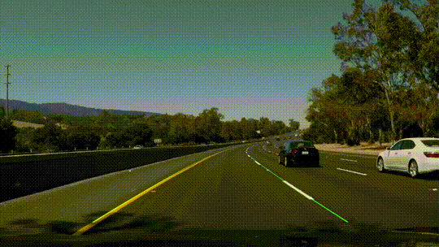

# lane-iwakura

present day

PRESENT TIME HHAHAHAHAH

Детектирование дорожной разметки с помощью OpenCV.

## Демонстрация:



## Запуск:

```bash
git clone https://github.com/equi17/lane-iwakura
cd lane-iwakura
python -m venv venv
source venv/bin/activate
pip install opencv-python numpy
python main.py
```

Видео надо поместить в папку с проектом и назвать road.mp4

## Как работает:

frame -> canny -> road_mask -> perspective -> fit_poly -> smoother -> draw -> inverse_perspective -> result

- canny() — границы дороги
- road_mask() — отсекаем шум по бокам
- perspective_transform() — вид сверху
- fit_poly() — аппроксимация линий
- LaneSmoother() — сглаживание
- inverse_perspective() — возврат в исходный вид

## Зависимости:

- opencv-python
- numpy

## Лицензия: MIT